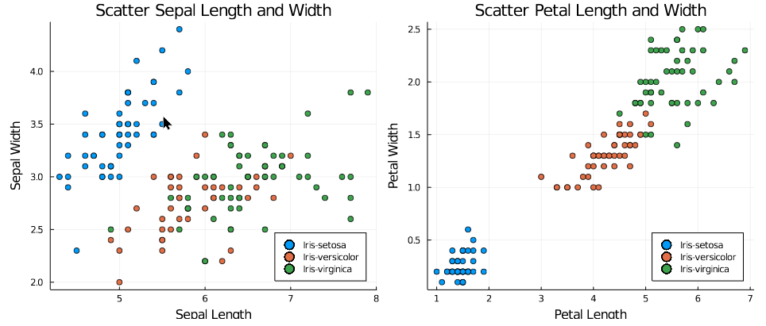
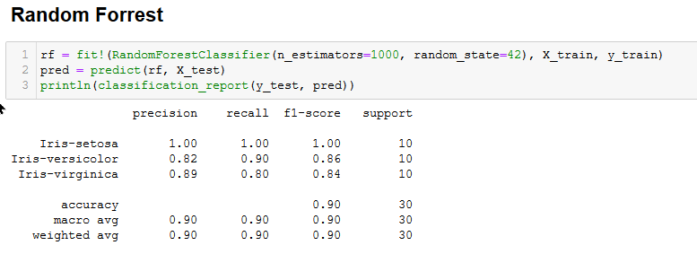

<h1>Machine Learning with Julia 101</h1>

This is some simple example how to use Julia Programming Language in Machine Learning. We are not gonna do some expensive machine learning stuff like feature engineering, cross validation, parameter tuning, etc. This is just some basic classification using scikit-learn from python. 
 
First of all, the dataset we use is iris dataset from <a href="https://archive.ics.uci.edu/ml/machine-learning-databases/iris/iris.data" title="Iris-Dataset">ICS</a>. Then we gonna do some simple EDA, and plots some graph. Here's some picture for you.

