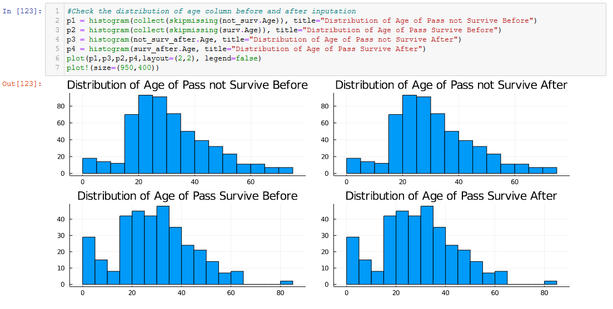

<h1>Machine Learning 102 with Julia LightGBM Framework</h1>

This is some intermediate example how to use Julia Programming Language in Machine Learning. We are gonna do some machine learning stuff like missing value detection, inputation missing value, cross validation, dan feature engineering. This classification using LightGBM package for Julia. 
 
First of all, the dataset we use is titanic dataset from <a href="https://www.kaggle.com/c/titanic/data" title="Titanic Dataset">Kaggle</a>. Then we gonna do some EDA related to the data, and plots some graph. Here's some picture for you.

