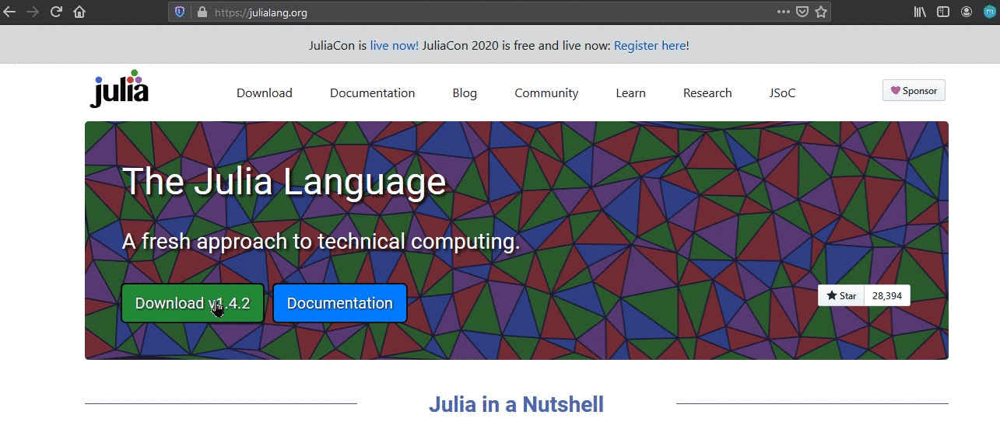

<h1>What is Julia?</h1>

Julia is a high-level, high-performance, dynamic programming language. While it is a general purpose language and can be used to write any application, many of its features are well-suited for numerical analysis and computational science. 
 
Because Julia's compiler is different from the interpreters used for languages like <strong>Python</strong> or <strong>R</strong>, you may find that Julia's performance is unintuitive at first. Once you understand how Julia works, it's easy to write code that's nearly as fast as C. 
 
So, why use Julia? 
<ul>
<li>Julia was designed from the beginning for <strong><em>high performance</strong></em>.Julia programs compile to efficient native code for multiple platforms via LLVM.</li>
<li>Julia is <strong><em>dynamically</strong></em> typed, feels like a scripting language, and has good support for interactive use.</li>
<li>Julia has a <strong><em>rich language</strong></em> of descriptive datatypes, and type declarations can be used to clarify and solidify programs.</li>
<li>Julia uses <strong><em>multiple dispatch as a paradigm</strong></em>, making it easy to express many object-oriented and functional programming patterns. It provides asynchronous I/O, debugging, logging, profiling, a package manager, and more.</li>
<li>Julia has high-level syntax, making it an <strong><em>accessible language for programmers from any background</strong></em> or experience level.</li>
<li>Julia is provided under the MIT license, <strong><em>free for everyone to use</strong></em>. All source code is publicly viewable on GitHub.</li>
</ul> 

<h1>How to install Julia?</h1>

<ol>
<li>Go to <https://julialang.org/>, click download and choose your OS installation.</li>

</ol>
